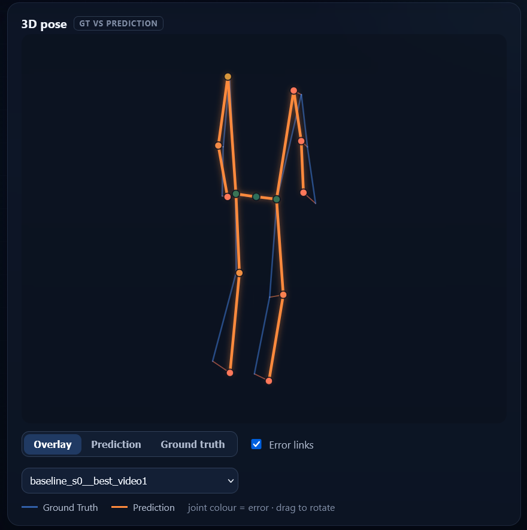
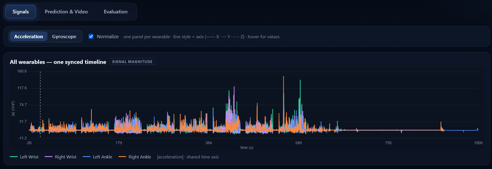
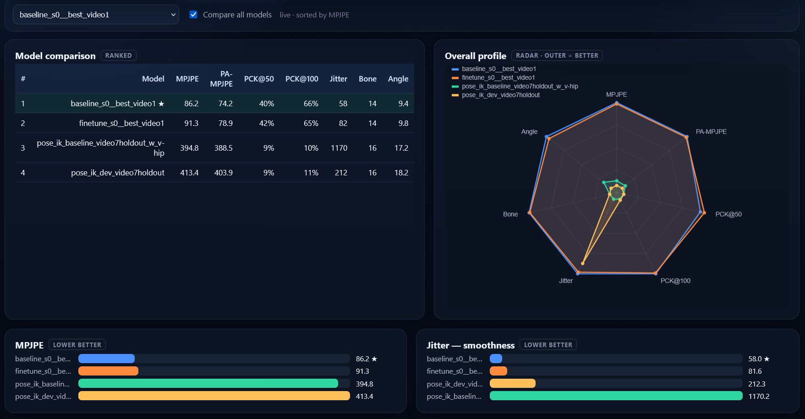
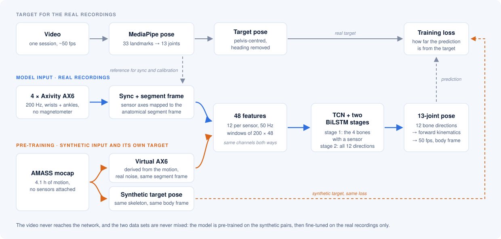

# 3D pose from four wrist- and ankle-worn IMUs

Estimating a 13-joint body pose from four Axivity AX6 sensors worn on both wrists
and both ankles, using video-derived poses as the training target and synthetic
AMASS motion as additional pre-training data.

Motion capture normally needs a camera, which means it stops at the edge of the
frame. Four sensors on the limbs do not, so the question is how much of a body pose
survives when the only thing you can measure is what the wrists and ankles are doing.

Technical Project, Hochschule Düsseldorf. Code and evaluation in this repository:
Dalia Salih. See [Acknowledgements](#acknowledgements) for the parts of the project
that were joint work.

**[Constraints](#the-two-constraints-that-shape-everything)** ·
**[Results](#results)** ·
**[Getting started](#getting-started)** ·
**[How it works](#how-it-works)** ·
**[Layout](#repository-layout)** ·
**[Limitations](#limitations)** ·
**[Data and licences](#data-sources-and-licences)**

<p align="center">
  
</p>

<p align="center"><sub>Prediction (orange) against the video-derived ground truth
(blue), with the error drawn per joint.</sub></p>

| | |
|---|---|
| Input | 4 × Axivity AX6, accelerometer and gyroscope at 200 Hz, no magnetometer |
| Output | 13 joints, pelvis-centred, 50 fps, in a body-fixed frame |
| Target | MediaPipe 3D landmarks from a synchronised video |
| Data | 6 real recordings (≈ 1 h) plus 4.1 h of synthetic recordings from AMASS |
| Model | TCN stem → BiLSTM → two-stage bone-direction head, 4,439,568 parameters |
| Result | 91.7 mm MPJPE, leave-one-recording-out, against a 105.3 mm trivial baseline |

---

## The two constraints that shape everything

**Heading is not observable.** Comparable systems — DIP, TransPose, PIP, IMUPoser —
generally assume that sensor orientation is already available as an input, and in
practice those orientation estimates are usually magnetometer-supported. The AX6 has
no magnetometer, so rotation about the vertical drifts with the gyroscope integral.
Feeding an estimated orientation into the network would mean training on a quantity
that walks away at inference time. So the input uses only observable quantities, and
the target pose is defined without a heading at all.

How much that matters shows up at the hips. They sit rigidly 102 mm from the pelvis
and cannot have a real position error, yet in the world frame they carried about
58 mm. At that lever arm this corresponds to a rotation of roughly 33°, which every
joint further down the chain then inherits.


**Six recordings is not much** for 4.44 M parameters. One hour of data is 945
four-second windows if they are not allowed to overlap, so about 4,700 parameters
per independent window. Synthetic AMASS-derived recordings are used to
pre-train and the six real recordings to fine-tune. Mixing both into one pool would
drown six videos among hundreds.

---

## Results

Leave-one-recording-out over the six recordings, seed 0, MPJPE in mm. The paired
conclusion about pre-training below rests on all 18 comparisons, 3 seeds × 6 folds.

| | video1 | video2 | video3 | video4 | video5 | video6 | mean |
|---|---:|---:|---:|---:|---:|---:|---:|
| real data only | 89.4 | 103.3 | 83.9 | 92.8 | 93.1 | 87.6 | **91.7** |
| with pre-training | 88.7 | 114.3 | 85.6 | 92.5 | 92.2 | 87.4 | **93.4** |

The trivial mean-pose baseline of the same folds is 105.3 mm, so the model does learn
something, though the margin is not large.

**The body-fixed target frame was the largest single improvement in the project.**
The relative gain over the trivial baseline rises from 6.1 % to 13.4 %, and PA-MPJPE,
which removes global rotation on both sides and is therefore directly comparable,
goes from 77.7 to 70.6 mm.

**Synthetic pre-training has no effect I can measure.** Over 18 paired comparisons
the difference is +0.95 mm at t ≈ 0.84 — but running the same method with nothing
changed except the random seed produces differences of up to 4.31 mm. The noise of
the procedure is three to four times the effect it was supposed to measure, so the
conclusion is not "pre-training does not help" but "this setup cannot resolve an
effect of that size".

The error grows monotonically down the kinematic chain, from 0 mm at the pelvis to
about 160 mm at the wrists and ankles. That the sensor-carrying joints are the worst
looks wrong at first, but a sensor measures the orientation of its segment, not the
position of its joint, so the position still has to come through the whole chain from
the pelvis outward.

Full tables, per-joint errors, the plots and every check I ran are in
[`docs/RESULTS.md`](docs/RESULTS.md).

---

## Getting started

Python 3.10 or newer. `numpy`, `pandas` and `scipy` for preprocessing, features and
evaluation, `torch ≥ 2.0` for training and inference, `mediapipe` and `opencv` only
for extracting poses from video.

```bash
python -m venv .venv && source .venv/bin/activate   # Windows: .venv\Scripts\activate
pip install -r requirements.txt

export PYTHONPATH=src/poser        # Windows cmd: set PYTHONPATH=src\poser
```

The `poser` modules import each other flatly (`import skeleton`), so the package
directory has to be on the path.

> A GPU is strongly recommended. Everything up to the feature cache runs fine on a
> CPU in a few minutes. Training does not.

**Look at the results in the dashboard.** This is the quickest way to see what the
model actually does. It needs a trained run and the matching cache, both of which
come out of the pipeline.

```bash
python src/poser/npz_to_dashboard.py --models models/ft_s0 \
    --cache cache/real_body --data data/processed
cd dashboard && python serve.py        # localhost only, http://127.0.0.1:8000
```

Pick the project root and choose a recording. There are three tabs.

**Signals** shows acceleration and angular rate of all four sensors on one shared
time axis. This is where the landing impacts the whole feature design is built around
become visible, and where a dead sensor or a swapped mounting shows up immediately.



**Prediction & Video** puts the reference video next to a 3D view of the skeleton,
which can be shown as prediction only, ground truth only, or both overlaid with the
per-joint error drawn as links — that is the view at the top of this page.
Predictions from body-frame models are rotated back into the world frame using the
ground-truth heading so the skeleton lines up with the video. No error figure changes,
since both sides are rotated by the same matrix, but it is flagged as
`heading_from_gt`, because heading is not something the model predicts.

**Evaluation** is where the numbers are: several trained models ranked on the same
recording, a radar profile across all metrics, and MPJPE, jitter, bone-length error
and joint angle side by side.



**Running the pipeline yourself** — including on your own recordings, which needs a
side-view video of the whole body and four AX6 exports with a few jumps at the start
— is described step by step in [`docs/PIPELINE.md`](docs/PIPELINE.md). Two commands
in there run without any data at all and are worth trying first.

---

## How it works



**Sensor frame.** An IMU measures its own housing (not the body), so how the band
happened to sit that day is present in every channel. Systems of this kind commonly
handle it with a recorded calibration pose; none was recorded here, but there is a
video for every recording, so the mounting rotation is estimated over the whole
recording instead, with a Kabsch fit of the measured gravity direction against an
anatomical frame derived from the pose. Changing only the band orientation moves the raw signal by 128
units and the segment-frame signal by 0.34.

**Input, twelve channels per sensor, 48 in total.** Gravity direction (3) from a
complementary filter without the magnetometer branch, linear acceleration (3),
angular rate (3, never integrated), the two magnitudes, and the energy in the
20–90 Hz impact band. That last channel is computed at the full 200 Hz and only its
envelope is brought down to 50 Hz, because the landing impact sits above what 50 Hz
can represent and would otherwise be lost. It comes out about six times larger at the
ankles than at the wrists, which is the sanity check that it measures what it should.

**Output.** Twelve bone directions as unit vectors, not joint positions and not 6D
rotations. With fixed bone lengths that is an exact parameterisation of a
pelvis-centred pose — 24 degrees of freedom, exactly as many as the pose has — and
bone lengths are then correct by construction. Free coordinates would let the network
stretch bones; 6D rotations would add twist about the bone axis, which is not present
in joint positions and could therefore never be supervised.

**Network.** `48 features → LayerNorm → TCN stem → BiLSTM (2 × 256) → stage 1: the
four sensor-carrying bones → BiLSTM (1 × 256) → stage 2: all twelve bones → forward
kinematics → 13 joints`. The stem has a receptive field of about 0.58 s, the
timescale of a landing rather than a stride. Stage 1 predicts only the bones that
actually carry a sensor and hands them to stage 2 as an anchor, so the unobserved
bones are placed relative to reliable ones instead of from nothing. The two-stage
leaf-to-full structure follows TransPose.

**Synthetic data.** AMASS sequences are converted to the same 13-joint format,
virtual sensors are placed at a fixed offset on the segment, and the derived signals
are degraded with a noise profile measured from the real recordings rather than
assumed. The check is not whether it looks real but whether it sits closer to a real
recording than two real recordings sit to each other: median distance 0.22 σ on both
sides, and closer in 69 % of the 48 features.

The reasoning behind each of these decisions is written up properly in the project
report in [`docs/`](docs/); the numbers behind them are in
[`docs/RESULTS.md`](docs/RESULTS.md).

---

## Repository layout

```
src/preprocess/   video → pose, synchronisation, segment calibration
src/poser/        features, model, training, evaluation
src/synth/        synthetic IMU data from AMASS
dashboard/        local web dashboard for inspecting predictions
config/           canonical skeleton, for the full dataset and the sample
data/sample/      90 s excerpt of one recording, so the pipeline can be run
docs/             results, pipeline instructions, project report
```

What each script does is described where it is used, in
[`docs/PIPELINE.md`](docs/PIPELINE.md). `data/raw/`, `data/processed/`, `cache/`,
`models/`, `logs/` and `synthdata/` are not version-controlled, apart from the
bundled sample.

---

## Limitations

- **No global position, no heading.** Absolute position is not observable from
four limb IMUs. Heading is not reliably observable without an external heading
reference such as a magnetometer. A trunk sensor would constrain torso motion,
but would not establish an absolute heading by itself.
- **Offline only.** The BiLSTM is bidirectional and the impact-band feature needs a
  sliding window. Switching to unidirectional LSTMs is not a structural change, but
  it would cost accuracy.
- **Six recordings, four subjects.** The 18 paired comparisons come from six
  recordings and are not independent of each other, so everything here is a
  directional statement and not a significance claim.
- **The ground truth is MediaPipe, not a marker system.** Bone lengths fluctuate by
  about 20 mm frame to frame, and the side facing away from the camera is measured
  systematically shorter — 412 mm left thigh against 342 mm right in the canonical
  skeleton. Training and evaluation use the same targets, so comparisons between
  variants are not distorted, but anything below roughly 20 mm would be fitting noise
  in the ground truth.
- **The synthetic motion is missing the activity that matters.** The ankle-to-wrist
  impact ratio is 2.75 synthetic against 6.05 real, because AMASS has little jumping
  in it and the selection weights for diversity across datasets, so martial arts,
  gestures and crawling end up in the set. That is the most likely reason the
  pre-training shows nothing: the synthetic data misses exactly the part of the
  signal that carries the legs. `src/synth/filter_manifest.py` filters the selection
  towards leg-dominant motion.
- **The synthesis had an artefact in the impact band.** AMASS runs at 120 Hz and the
  sensor grid at 200 Hz, and the resampling left an image of the source rate at
  80 Hz — inside the 20–90 Hz band, amplified by ω² in the double differentiation.
  Diagnosis and fix are in `src/synth/synth_imu.py`; `docs/RESULTS.md` §3 has the
  measurements.

---

## Data sources and licences

| Source | Use | Availability |
|---|---|---|
| AMASS (Mahmood et al., ICCV 2019) | Motion sequences for synthetic pre-training | Not included. Own licence, MPI for Intelligent Systems, https://amass.is.tue.mpg.de |
| SMPL-H ("Extended SMPL+H", not SMPL-X) | Joint regression from AMASS parameters | Not included, same source and licence |
| Own recordings (6 sessions, 4 subjects, AX6 and video) | Fine-tuning and all evaluation | Not published, they contain identifiable video. A 90 s excerpt is in `data/sample/` |
| MediaPipe Pose (Google) | 3D landmark ground truth from video | Apache 2.0 |

References: Mahmood et al., *AMASS*, ICCV 2019 · Huang et al., *Deep Inertial Poser*,
SIGGRAPH Asia 2018 · Yi et al., *TransPose*, SIGGRAPH 2021 · Yi et al., *Physical
Inertial Poser*, CVPR 2022 · Mollyn et al., *IMUPoser*, CHI 2023 · Mahony et al.,
*Nonlinear complementary filters on the special orthogonal group*, 2008

---

## Acknowledgements

The project began as joint work with github member **a-rabanus**. The recording sessions, the video-IMU synchronisation and the definition of the 13-joint skeleton were done together, and the sensor data and ground truth in this repository come out of that
shared groundwork. A second modelling approach was developed in parallel on the same
data; it is not part of this repository or of the evaluation reported here.

Course: Technical Project, Hochschule Düsseldorf. 
